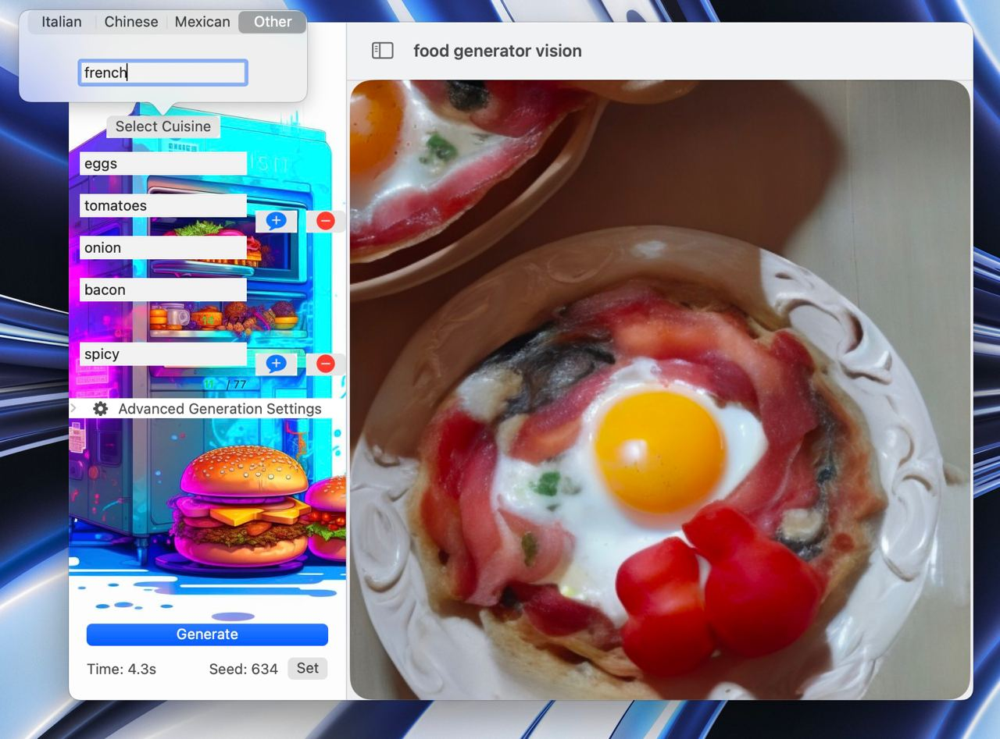
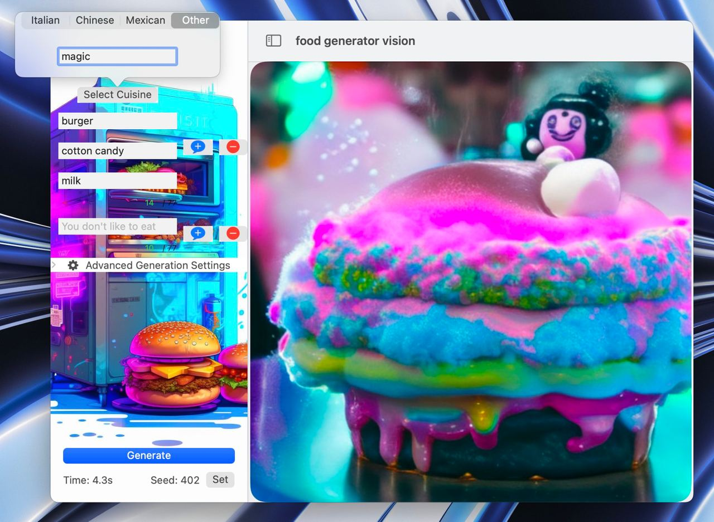

#  Food Generator🍔 with Stable Diffusion🎨 on macOS🍏

Discover the power of stable diffusion models in macOS applications with our Swift-based project. This application seamlessly integrates the cutting-edge capabilities of stable diffusion models into the macOS environment, making it accessible to a wide range of developers.

This project builds upon the foundation of the [swift-coreml-diffusers](https://github.com/huggingface/swift-coreml-diffusers) library, which, in turn, inherits its functionality from the renowned Python library, [diffusers](https://github.com/huggingface/diffusers), developed by [Hugging Face](https://github.com/huggingface). This powerful lineage ensures that our application leverages state-of-the-art techniques and models to deliver impressive results.

Experience the simplicity of creating your own application that can perform inference directly on your MacBook with M1/M2 processors, without the need for dedicated GPU resources. Explore the world of stable diffusion models and harness their potential within your macOS projects. Join us in shaping the future of machine learning on macOS!

1. Write down which products you have in the refrigerator
2. Choose a cuisine
3. Enjoy your prepared meal

Your pictures can be generated in 4 seconds on m2 macbook air 

You can come up with something everyday:

But you can also blow your mind:

## Requirements
* MacBook M1/M2
* macOS Ventura `13.1>=`
* Xcode `15.0>=` (beta is ok)

## How to Run/Build
1. `git clone https://github.com/germanjke/food-generator-vision.git`
2. Open project in Xcode
3. `Product` -> `Run` or `Build`

## What can be improved
1. Discover more models
2. Finetune models for you tasks
3. Write app which you want
...
